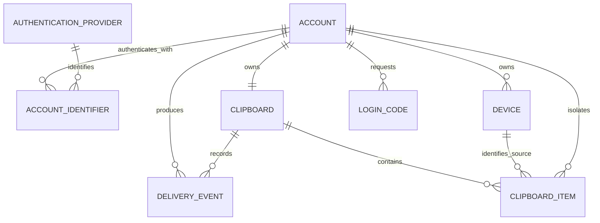

# Data model

The YAML JSON Schemas in `apps/public/clip-sync-api-hono/src/data/schemas/` are the persisted-contract source of truth. PostgreSQL migrations live beside them under `src/data/migrations/`; the MongoDB implementation is `src/data/models/clipboard-item.js`.

| Object | Store | Purpose and key constraints |
|---|---|---|
| Account | PostgreSQL | One person; globally unique 32-character UID; soft-delete columns. |
| Authentication provider | PostgreSQL | Controlled email (`E`) and Google (`G`) provider rows. |
| Account identifier | PostgreSQL | Unique normalized provider subject; links verified identities to one account. |
| Clipboard | PostgreSQL | Exactly one active clipboard per account through a unique account key. |
| Device | PostgreSQL | Stable installed-client UID, platform, OS-reported name, and optional account-assigned name; every lookup and rename is account-scoped. |
| Login code | PostgreSQL | Expiring hashed challenge, attempt count, and one-time consumption timestamp. |
| Delivery event | PostgreSQL | Immutable item-creation/delivery event with source client and item UID. |
| Clipboard item | MongoDB | Text or image bytes, duplicated account/clipboard UIDs for ownership queries, optional source-device UID for legacy compatibility, and created/deleted timestamps. |

Every repository method includes account ownership in its lookup. The API never accepts an account UID or clipboard UID from the client, preventing insecure direct object references. Device rename lookups combine the authenticated account with the requested device UID. MongoDB indexes support newest-first active history and unique item retrieval. PostgreSQL foreign keys, check constraints, unique constraints, and lookup indexes enforce identity and ownership invariants.

The data set has no cross-account relationship and no sharing table. This is intentional and required by product scope.
