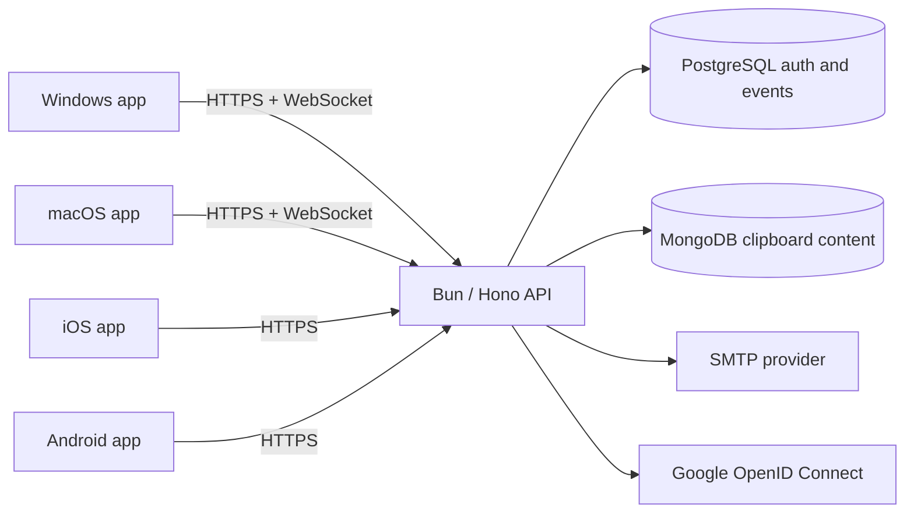

# Architecture decisions

This document closes the implementation questions in the approved POC requirements. Decisions intentionally favor the smallest complete, maintainable vertical slice.

## System boundary

One Bun process exposes a Hono UX API and WebSocket endpoint. It contains explicit route, service, repository, and datastore boundaries without separate deployable microservices. Four independent Flutter apps share only the cross-platform client behaviors in `clip-sync-client-core-flutter`.

## Authentication

- Google uses OpenID Connect (OIDC). The API validates the signed Google ID token, issuer, audience, email, and verified-email claim.
- Native builds receive the explicitly approved Google web OAuth client values from `keys/google-oauth.json`. Local Compose mounts the same file read-only so the API can validate Google token audiences without shell configuration. Desktop authorization returns through the exact `http://localhost:8000` loopback URI. A repository launcher validates the file, avoids displaying its values, and removes its temporary Flutter configuration after each Flutter command.
- Email sign-in uses a random six-digit code that expires after ten minutes, is single-use, and permits five failed attempts. Only a keyed hash is stored.
- Successful sign-in returns a signed 30-day JSON Web Token (JWT). Native clients store it only in platform secure storage.
- A verified email address links email and Google identifiers to one account. The first sign-in transaction creates both the account and its single clipboard.
- Auth endpoints are rate limited. All request payloads, size limits, and environment variables are validated.

The POC deliberately has no organization, membership, administrator, token-revocation, or device-management models because those capabilities are outside the approved scope.

## Clipboard behavior

- Supported payloads are UTF-8 text up to 256 KiB and PNG, JPEG, or WebP photos up to 10 MiB after decoding.
- History is newest-first with 50 items per page by default and a maximum page size of 100. Items remain indefinitely until soft-deleted by their owner.
- A desktop polls the operating-system clipboard while active. It compares a SHA-256 fingerprint so an unchanged or remotely applied value is not uploaded again.
- Pausing records the current clipboard fingerprint as the baseline. Resuming records a new baseline, so content copied during the pause is never uploaded later.
- The WebSocket hub holds online connections in process memory. A newly persisted item is sent to other online Windows/macOS client identifiers only. There is no message queue and no reconnect replay.
- Manually copying a history item updates the local clipboard and loop-prevention baseline without uploading a duplicate.
- Mobile apps never poll the clipboard and never open the real-time connection. The visible iOS history screen uses the approved 5-second, 30-second, then paused refresh schedule; pull-to-refresh or the Refresh button reloads the newest server page and restarts that schedule. The visible macOS history screen follows the same schedule independently of its real-time desktop clipboard connection.

## Persistence and consistency

PostgreSQL is authoritative for identities, one-to-one clipboard ownership, login challenges, and immutable creation/delivery audit events. MongoDB is authoritative for clipboard content and its content index. Creating an item writes MongoDB first, then its PostgreSQL event. If the event write fails, the newly written MongoDB item is immediately removed as compensation. User deletion is a MongoDB soft delete; the POC does not invent a separate deletion-event contract that the requirements did not define.

This is a POC consistency boundary, not a distributed transaction. A production evolution could use a durable outbox, but it is not introduced without evidence that the POC requires it.

## API and deployment

- Native client routes use `/ux/v1`; there is no speculative domain API surface.
- API errors have stable `code` and human-readable `message` fields, and responses carry a correlation identifier.
- API, PostgreSQL, and MongoDB run in Docker for local, development, and production. Local also includes Mailpit for inspecting email codes.
- The target is one large Amazon EC2 host using Docker Compose. TLS termination, DNS, backups, and host hardening remain deployment-operator responsibilities and are called out in the runbook.

## Standards decisions

Briskhaven engineering, API, data, security, documentation, and deployment guidance is applied at POC depth. Three conservative project-specific choices take priority over more general patterns: the product's exact one-account/one-clipboard rule replaces multi-tenant organization and membership models; the Docker-only deployment omits an unused serverless handler; and the product owner explicitly approved the distributed native-client OAuth configuration for source control. That approval is limited to `keys/google-oauth.json` and does not cover production service secrets, signing keys, or user tokens. These are scope decisions, not architectural extension points.
